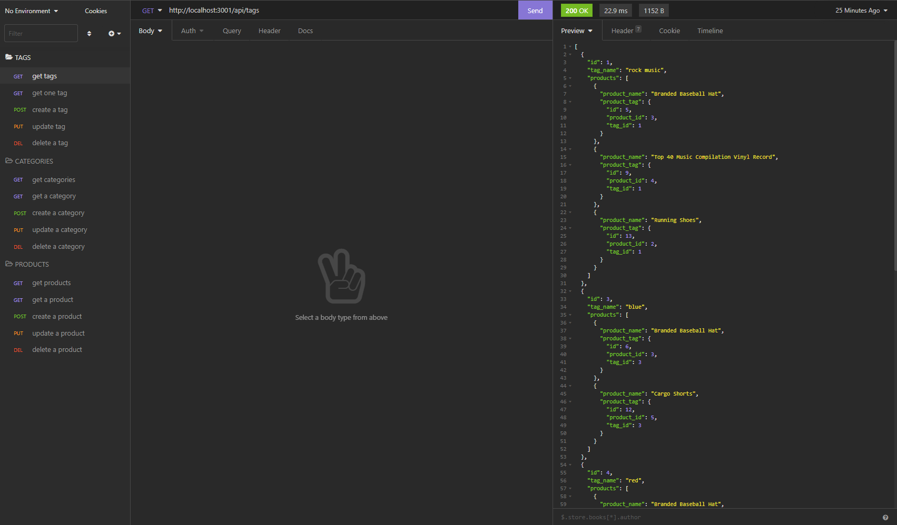

# E-commerce Back End Starter Code

## Description
E-commerce is one of the largest sectors of the electronics industry, making the fundamental architecture of e-commerce sites essential to understand as a developer. This challenge was to build a back end for an e-commerce, given a working Express.js API and product data from a company. Using Sequelize, a MYSQL database, and Insomnia, this application can allow a company to organize and update their product data as well as help developers learn how to navigate the API.

### User Story
```
As a manager at an internet retail company
I want a back end for my e-commerce website that uses the latest technologies
so that my company can compete with other e-commerce companies.
```

### Expected Functionality of Application
These were the requirements for this specific challenge:
```
GIVEN a functional Express.js API
WHEN I add my database name, MySQL username, and MySQL password to an environment variable file
THEN I am able to connect to a database using Sequelize
WHEN I enter schema and seed commands
THEN a development database is created and is seeded with test data
WHEN I enter the command to invoke the application
THEN my server is started and the Sequelize models are synced to the MySQL database
WHEN I open API GET routes in Insomnia Core for categories, products, or tags
THEN the data for each of these routes is displayed in a formatted JSON
WHEN I test API POST, PUT, and DELETE routes in Insomnia Core
THEN I am able to successfully create, update, and delete data in my database
```

## Installation
In order to use this project, you can clone this repository onto your own system. Create your own `.env` containing your MYSQL username and password, and the database name. Make sure to also create a `.gitignore` file in the projects root directory with `node_modules`, `.env`, and `.DS_Store` in good practice. This application requires node.js, [Sequelize](https://www.npmjs.com/package/sequelize), [MYSQL2](https://www.npmjs.com/package/mysql2), and [dotenv](https://www.npmjs.com/package/dotenv). This requires entering the command `npm init` to initialize node.js in the projects root directory, followed by `node install sequelize mysql2 dotenv`. You will also need to have Insomnia in order to test the API routes and view the data on the backend.

## Usage
After these are installed, you can type `npm run seed` in order to populate the database with the default product data. Then, run `npm start` to start the server. Now you will be able to open Insomnia and test out the routes on your local server. The following image demonstrates how to format the URL as well as the routes that are available to be tested.



### Routes
* Tags: https://localhost:3001/api/tags
* Categories: https://localhost:3001/api/categories
* Products: https://localhost:3001/api/products

## Questions
If you have any questions on this project, feel free to reach me through my [GitHub profile](https://github.com/adairconlin), or email me at adairconlin@gmail.com.